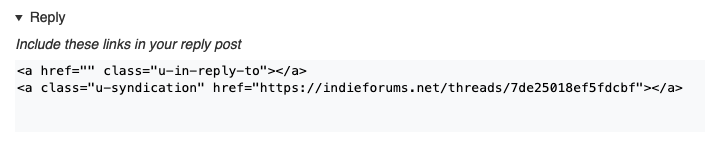

IndieForums is a proof-of-concept site built around the [IndieWeb](https://www.indieweb.org). All content on this site (with the exception of /self/ posts) is generated through [webmentions](https://webmention.io).

## Quick Start

### 📝 New Thread
Send a webmention from your post to www.indieforums.net. That's it. The cleanest way to do this is an empty `a` tag with `class="u-syndication"`. 

```
<a href="https://www.indieforums.net" class="u-syndication"></a>
``` 

### ↩️ Reply to a thread
Send a webmention to the URL of said thread:

```
<a href="https://www.indieforums.net/threads/7de25018ef5fdcbf.html" class="u-syndication</a>
```

You should include a reply-to webmention back to the original authors site, too. To make this easy, just click reply on any post and the links for that post will be ready for you!



### ⚠️ Report a post
Click the Report link at the bottom of each post to open a new email (please leave the subject as-is). The body of the email should contain the issue you see with that post.

### ❓ I don't have a site
Check out the [Getting Started](https://indieweb.org/Getting_Started) section of the IndieWeb wiki. [Micro.blog](https://micro.blog) is probably your quickest choice.

## But why?

The IndieWeb is a decentralized way of interacting on the internet. Through webmentions, one site (or person, organization, etc) can tell another that it was linked to, that they replied to a post, liked a page, RSVP'd to an event, bookmarked a page, etc. You can also syndicate your post to other sites, and that is the mechanism for publishing to IndieForums. Using the IndieWeb to run a forum means the forum needs no database, usernames, passwords, forms, etc. All content is independently archived somewhere else on the internet.

In my random reading about IndieWeb things, I ran across [IndieWeb News](https://news.indieweb.org), a news aggregator built by [Aaron Parecki](https://aaronparecki.com), one of the founders of the IndieWeb. It looked like an awesome idea and I thought it would be cool to add comments and I thought "I could build that"...so I did!

And why a forum? Who doesn't like old-school forums? You want threaded comments? Not here! Just plain old sort-by-new, single threads.

## More site details

This site is statically generated every time a webmention is sent. It doesn't use any client-side javascript. It doesn't track you (well, Netlify does to some degree).

This site is built using the following tools:

- [11ty](https://www.11ty.dev) to build the site
- [Github](https://github.com) to host the repository
- [Netlify](https://netlify.com) to host the site
- [Webmention.io](https://webmention.io/) to receive webmentions

<a href="https://www.indieforums.net" class="u-syndication" title="Syndicated to Indieforums"></a>